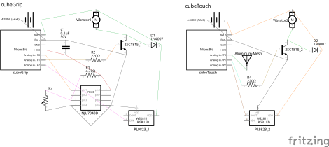
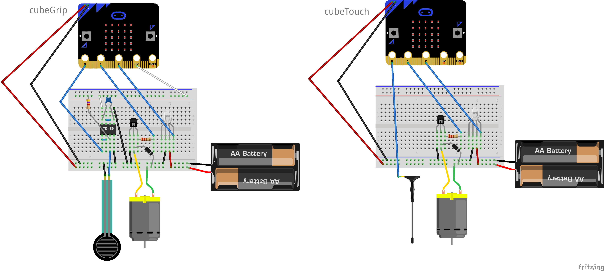
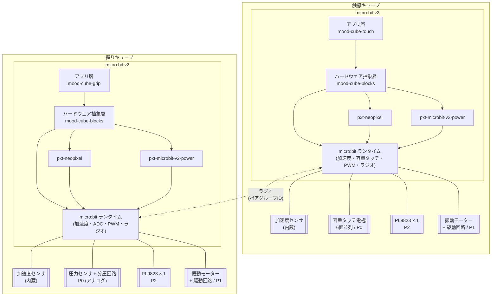

# システム構成

mood cube 1ペアの実行時構成を示す。

## ハードウェア構成

触感キューブと握りキューブはP0に繋ぐセンサだけが異なり、それ以外 (PL9823 / 振動モーター駆動回路 / 電源) は共通。

### 回路図

### ブレッドボード図

## ソフトウェア構成

触感キューブと握りキューブはそれぞれ独立したmicro:bit v2で動き、micro:bitのラジオ機能でペア連動する。アプリ層は各キューブのリポジトリ (mood-cube-touch / mood-cube-grip) に置かれ、mood-cube-blocksが公開するブロックを通じてハードウェアに触れる。

## レイヤの責務

### アプリ層 (mood-cube-touch / mood-cube-grip)

子供がblocksエディタで組む体験ロジック。起動時に`cubePair`で自分の役 (触感/握り) を宣言する。入力イベントと出力ブロックの結びつけ、モード切替、発光・振動パターンの時間制御をここで書く。

### mood-cube-blocks (本拡張)

ハードウェア抽象層。5つのnamespaceで入出力をブロック化する。pxt-neopixelやmicro:bitランタイムAPIをアプリ層から隠蔽する。

### pxt-neopixel

PL9823の駆動実体。mood-cube-blocksの内部依存として組み込まれ、アプリ層からは直接見えない。

### pxt-microbit-v2-power

deepSleep制御と周期wakeコールバック、ハード起床ソース設定 (ボタン・ピン) を扱う公式拡張。mood-cube-blocksの内部依存として組み込まれ、アプリ層からは見えない。自動省電力は3分アイドルで突入し、ハード割り込みか1秒周期wakeで復帰する。

### micro:bitランタイム

加速度センサ、容量タッチ、ADC、PWM、ラジオなどmicro:bit v2が標準で備える機能。

## ペア連動

両キューブのmicro:bitランタイムが内蔵ラジオで通信する。アプリ層からはラジオの存在は隠され、`cubeTouch` / `cubeGrip`のイベントとポーリングが「自分のキューブから来たか相棒から来たか」を意識せずに使える形に揃えられる。混信回避のためのペアグループIDは`cubePair`で設定する。

通信の挙動:

- 入力イベント (上面変化・ピン刺し・握り強さ・手に取る・置くなど): 発生側が1.2秒間50ms間隔で連投し、受信側でも同じイベントとして発火する。連投は寝ている相棒の周期wake (1秒以内) で確実に拾わせるため。両者がアクティブ中は最初の数発で受信され、残りは冗長に流れるだけ
- ポーリング値 (上面の現在値・握り強度): 取得ブロックが呼ばれた瞬間にリクエストを送り、応答を同期で待つ。タイムアウト時はデフォルト値を返す
- 出力 (発光・振動): 自分のキューブにのみ作用し、相手には伝搬しない
