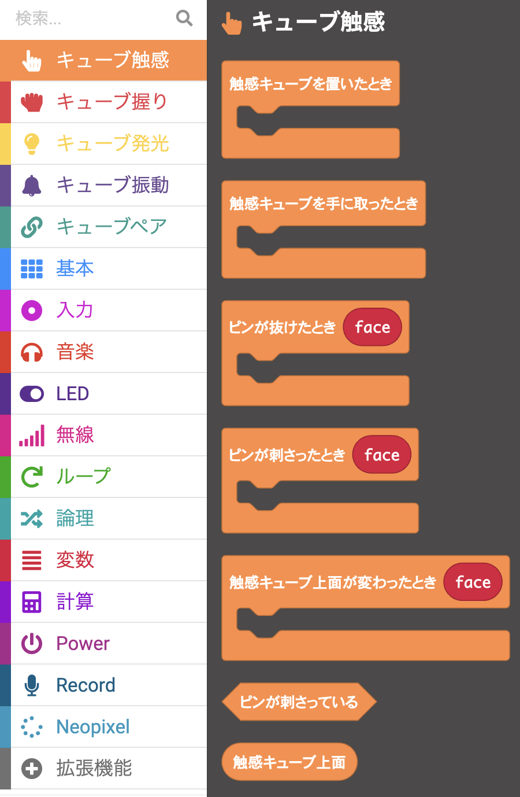
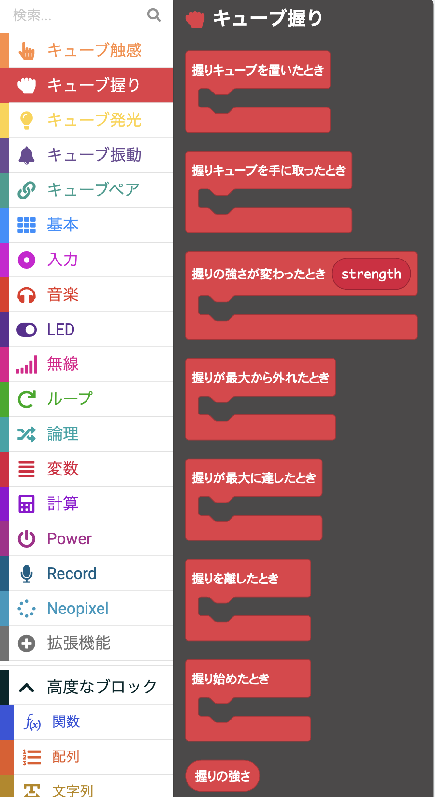
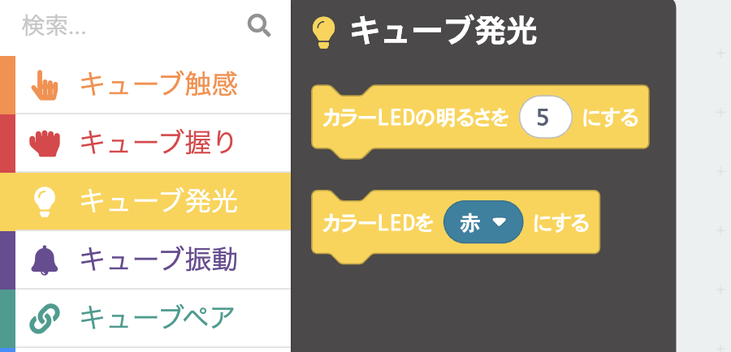
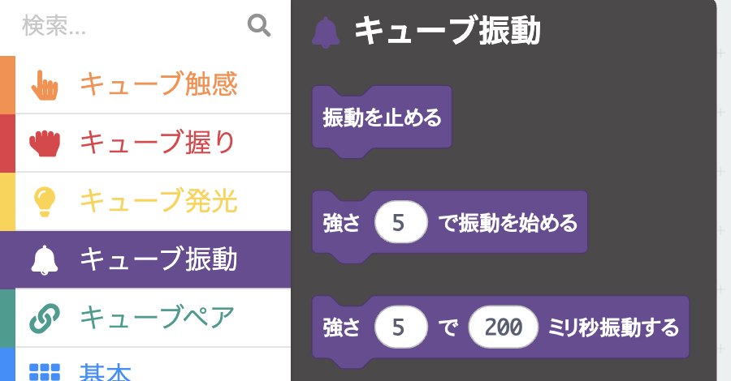
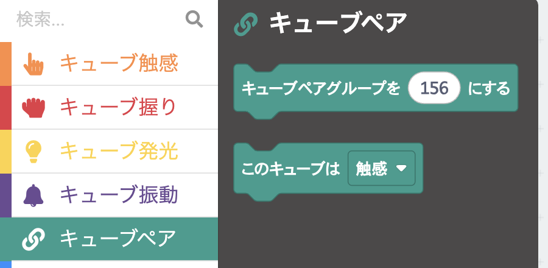

# mood cube

micro:bit v2を内蔵したフィジェット作品。「触り心地」と「力の発散」の対をなす2つのキューブで構成する。手元に置いて触ったり握ったりして気分を整える小物として作っている。

このリポジトリは作品を支える3つのリポジトリのうち、ハードウェア抽象を担うMakeCode拡張機能。

<!-- 作品全体のキャプチャをここに追加 -->

## 2つのキューブ

### 触感キューブ

透明アクリル製 (約6cm角)。6面それぞれに異なる触感の素材を貼り、ピンを刺して触感を楽しむ。内部にmicro:bitとPL9823 (フルカラーLED) を仕込み、上を向いた面に応じて光や振動で反応する。受動的・静的な体験を担当する。

<!-- 触感キューブのキャプチャをここに追加 -->

### 握りキューブ

布製お手玉式 (約6cm角)。中にmicro:bitと圧力センサを仕込み、握りしめる強さに応じて光と振動が変化する。能動的・動的な体験を担当する。

<!-- 握りキューブのキャプチャをここに追加 -->

## このリポジトリの位置づけ

mood cubeはハードウェアの組み立てと、micro:bit上で動く挙動ロジックの2層で成り立つ。本リポジトリはハードウェアに近い層をMakeCode拡張機能として提供する。

上位のアプリ層はMakeCodeのブロックUIで組む。どの入力で何を光らせるか、どんな体験を作るかはアプリ層が決める。較正値や配線が変わってもアプリ層は触らずに済む構造になっている。

## 提供するブロック群

5つのnamespaceに分かれており、ブロックパレット上でひとまとまりとして見えるよう共通プリフィックス`cube`を付けている。

### cubeTouch
触感キューブの入力。上を向いた面の取得、ピンが刺された・抜けた瞬間のイベント、触感キューブを手に取った・置いた瞬間のイベントを提供する。

### cubeGrip
握りキューブの入力。握る強さの取得 (0-9)、握り始め・離した・最大到達などの瞬間のイベント、握りキューブを手に取った・置いた瞬間のイベントを提供する。

### cubeLight
両キューブ共通の発光制御。プリセット色10色と明度 (0-9) を指定できる。

### cubeVibe
両キューブ共通の振動制御。強度 (0-9) を指定して同期/非同期に振動させる。

### cubePair
ペア間連動。片方のキューブで起きた入力をもう片方のコードから扱えるようにする。

